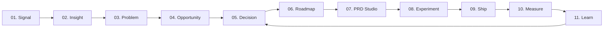

# ARGUS UX Architecture & Interaction Specification (`ARGUS_UX.md`)

> **Version**: 2.0.0  
> **Classification**: AI PM Operating System Interaction Architecture  
> **Repository Target**: `c:\Users\MAHIR\Desktop\tapwise`

---

## 1. The Core Product Continuum

ARGUS exists to eliminate the disjointed tool fragmentation currently plaguing product management (switching between Datadog, Amplitude, Zendesk, Jira, Notion, and Statsig). 

ARGUS unifies the product lifecycle into an unbroken continuous loop:

### Lifecycle Object Definitions

1. **Signal (`SIG-xxx`)**: Raw anomalies detected in telemetry streams (gateway latency spikes, payment timeout bursts, drop in conversion).
2. **Insight (`INS-xxx`)**: Correlated multivariate patterns (e.g. 14,200 failures clustered specifically on HDFC UPI switch queues).
3. **Problem (`PRB-xxx`)**: Verified customer pain points synthesized with impact quantification (e.g. ₹4.2Cr GMV exposed).
4. **Opportunity (`OPP-xxx`)**: Hypothesized product intervention ranked via Bayesian conviction and RICE prioritization.
5. **Decision (`DEC-xxx`)**: Signed-off executive commitment with immutable reasoning log and architectural tradeoffs.
6. **Roadmap (`RD-xxx`)**: Scheduled delivery horizon with explicit dependency mapping and cross-sprint blocker indicators.
7. **PRD Spec (`PRD-xxx`)**: Structured technical requirements document featuring Gherkin acceptance criteria, API payloads, and risk matrices.
8. **Experiment (`EXP-xxx`)**: Controlled A/B deployment featuring automated telemetry guardrails and rollback thresholds.
9. **Ship & Measure (`MEA-xxx`)**: Real-world cohort evaluation against baseline conversion, returning empirical learnings into the next decision.

---

## 2. Navigation Architecture & Wayfinding

ARGUS uses a predictable, spatial wayfinding model designed for zero disorientation:

### 1. Left Sidebar Navigation
Organized into 5 distinct operational groups:
- **Cockpit**: `Cockpit` (`overview`), `Inbox` (`inbox`)
- **Discover**: `Signals` (`signals`), `Feedback` (`feedback`), `Chaos Lab` (`chaos`)
- **Decide**: `Opportunities` (`opportunities`), `Prioritize` (`prioritize`), `Roadmap` (`roadmap`)
- **Build**: `Sprints` (`sprints`), `PRD Studio` (`prds`), `Specs & Docs` (`documents`), `Decisions` (`decisions`)
- **Measure**: `Experiments` (`experiments`), `Telemetry` (`analytics`)

### 2. Wayfinding Rules
- **Active State Indicator**: Marked with a crisp `2px` left border in `#0066FF`, white text, and a transparent background. No blue pill shapes or heavy glows.
- **Hierarchical Breadcrumbs**: Sticky top bar provides instant situational awareness (`Argus > Discover > Signals > SIG-884`).
- **Collapsible Sidebar**: Supports compact 44px icon-rail mode for widescreen data analysis without sacrificing navigation access.

### 3. Global Keyboard Shortcuts
- `⌘K` / `Ctrl+K`: Global Command Palette (instant jump to any signal, PRD, or experiment).
- `Escape`: Closes open inspection drawers, customizer panels, and modals.
- `?`: Opens keyboard shortcut reference modal.

---

## 3. Contextual Inspection Drawers vs Page Navigation

A core UX principle of ARGUS is **Zero Context Loss**:

| Interaction Type | Used For | Behavior |
| :--- | :--- | :--- |
| **Slide-Out Drawer (`ArgusDrawer`)** | Inspecting signal telemetry, reviewing evidence chains, auditing logs, checking health breakdowns | Opens from right edge (480px–640px). Keeps background dashboard visible. Allows closing via `Escape` or clicking backdrop. |
| **Full Page Workspace** | Authoring PRDs, tuning RICE sliders, editing roadmap dependencies, reviewing full A/B charts | Full viewport transition with dedicated breadcrumb trail and state persistence in `localStorage`. |

---

## 4. AI UX & Causal Attribution Standards

ARGUS never treats AI as a decorative chat widget or ungrounded generative hallucination.

### 1. The Causal Attribution Contract
Whenever ARGUS suggests an insight or recommendation:
- **Evidence First**: The interface must display the underlying telemetry sources (e.g. `14,200 ClickHouse rows · 34 Zendesk tickets · 0 code deploys past 48h`).
- **Explicit Confidence**: Bayesian conviction score is always displayed as a percentage (`94% Conviction`), not a vague "high/medium" rating.
- **Deterministic Action**: Every AI finding has a direct, actionable button (e.g. `Promote to OPP-014`, `Synthesize PRD Spec`).

### 2. No Fake "Thinking" Animations
AI deductions load instantly from cached causal graphs. When processing new streaming data, display factual pipeline status (e.g. `Correlating 4.2M events via ClickHouse partition`), never ambiguous "Magic is happening..." spinners.

---

## 5. State Handling: Empty, Loading & Error States

- **Empty States**: Must explain *why* there is no data and provide an immediate corrective action (e.g. "No anomalies detected in the last 24h · Run Chaos Simulator to inject synthetic traffic").
- **Loading States**: Use hairline shimmer placeholders (`bg-[#111] animate-pulse`) that precisely match the target element's dimensions. Never use full-screen blocking loaders.
- **Error Recoveries**: Telemetry ingestion errors offer 1-click retry and failover endpoint diagnostics without wiping active user forms.
