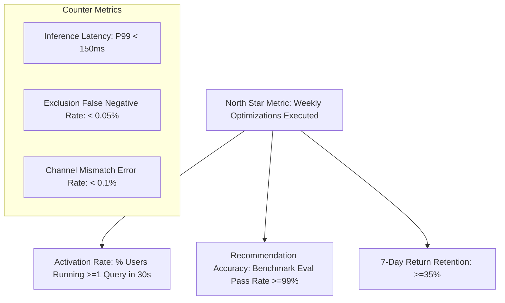

# Product Requirements Document (PRD)
## TapWise: Real-Time Credit Card Swipe Optimizer & Gateway Classifier

**Document Version:** 1.0  
**Target Market:** Urban Indian Cardholders (22–38 Yrs Old)  
**Primary Platform:** Mobile-First Web Application (PWA Ready)  
**Author:** AI Product Manager  

---

## 1. Executive Summary & Problem Statement

### 1.1 The Market Context
India is experiencing an unprecedented surge in credit card adoption, with over 100 million active credit cards in circulation. However, Indian credit card reward ecosystems have become notoriously fragmented and labyrinthine:
* **Obfuscated POS Strings**: Transaction SMS and statements are masked by payment aggregators (e.g., `RAZORPAY*BLINKIT GURGAON`, `PAYTM*DMART INDORE`, `BILLDESK*BESCOM`, `PINE LABS*CROMA`).
* **Channel Disparity Traps**: Cards award drastically different rewards based on the checkout channel. For example, **SBI Cashback** offers 5% on online grocery apps (DMart Ready, Blinkit, Zepto) but drops to 1% on in-store POS swipes at physical supermarkets (DMart, Reliance Fresh).
* **Fine-Print Devaluations**: Almost all major Indian issuers (HDFC, SBI, Axis, ICICI) recently introduced 0% reward exclusions and 1% processing fees on rent payments, fuel, wallet reloads, utilities, and jewelry.
* **Complex Multiplier Portals**: HDFC SmartBuy (5x/10x points) and Axis Travel EDGE require routing transactions through dedicated portals to unlock up to 16.6% returns.

### 1.2 The Core Problem
The average credit card enthusiast in India holds **3.2 cards**, yet over **₹2,400 Crores in rewards are forfeited annually** because consumers swipe the wrong card at POS or checkout. Traditional aggregation apps (e.g. CRED, Fold) suffer from high friction due to mandatory bank logins / SMS scraping permissions, leading to a 65%+ user drop-off before first value.

### 1.3 The Value Proposition: TapWise
> *"Zero-KYC, sub-second intelligence telling you the exact card to swipe for maximum cashback and reward value, accounting for POS gateways, channels, and fine-print exclusions."*

---

## 2. Target Personas & User Journeys

### Persona 1: "The Bangalore Techie Optimizer" (Rohan, 27, SDE-2)
* **Wallet**: HDFC Millennia, ICICI Amazon Pay, SBI Cashback, Tata Neu Infinity (RuPay).
* **Behavior**: Orders groceries on Zepto/Blinkit, eats on Swiggy, shops on Amazon Prime, scans UPI QR codes for daily chai and dining.
* **Pain Point**: Forgets which card gives 5% on Swiggy vs. Amazon, and doesn't know which card to link to Google Pay / Paytm for RuPay UPI.
* **Key Need**: Quick 2-second check before tapping "Pay Now".

### Persona 2: "The Travel & Miles Hacker" (Priya, 34, Product Lead)
* **Wallet**: HDFC Infinia Metal, Axis Atlas, Scapia Federal Bank.
* **Behavior**: High discretionary spend on domestic & international flights, luxury hotels, dining.
* **Pain Point**: Losing 16.6% SmartBuy return by booking flights directly on airline websites, or paying 4.13% forex fees abroad.
* **Key Need**: Instant confirmation whether to use Scapia (0% forex) or Infinia/Atlas (points transfer to Accor ALL/AeroPlan).

---

## 3. Metric Hierarchy

### 3.1 North Star Metric
* **Weekly Optimizations Executed (WOE)**: The total number of valid swipe lookups conducted by users with >=2 active cards in their wallet.

### 3.2 Counter-Metrics (Guardrails)
* **Recommendation Latency**: P95 < 50ms, P99 < 150ms. Must feel instantaneous.
* **Exclusion False Negative Rate (< 0.05%)**: Never recommend a card with a 0% exclusion (e.g., claiming 5% cashback on a Rent or Fuel transaction).
* **Channel Mismatch Error Rate (< 0.1%)**: Never recommend an online rate for an offline store swipe.

---

## 4. Product Functional Requirements

### 4.1 The Curated Card Deck (Top 15 Indian Powerhouses)
The app must launch with deep rule fidelity for 15 curated Indian cards:
1. **HDFC Infinia Metal** (3.3% base, 16.6% SmartBuy)
2. **HDFC Regalia Gold** (1.3% base, 6.6% SmartBuy / 5x brands)
3. **HDFC Millennia** (5% on 10 top merchant partners, 1% other)
4. **Tata Neu Infinity HDFC** (10% on Tata Neu, 1.5% on RuPay UPI)
5. **Tata Neu Plus HDFC** (7% on Tata Neu, 1.0% on RuPay UPI)
6. **ICICI Amazon Pay** (5% unlimited Amazon Prime, 2% bills, 1% other)
7. **ICICI Sapphiro** (BookMyShow BOGO, DreamFolks lounge)
8. **Axis Atlas** (5x Edge Miles on direct travel, 2x base)
9. **Airtel Axis Bank** (25% on Airtel bills, 10% on Swiggy/Zomato/BigBasket)
10. **Flipkart Axis Bank** (5% Flipkart, 4% Swiggy/Uber/Cleartrip/1mg)
11. **Axis ACE** (5% GPay utility, 4% Swiggy/Zomato, 1.5% flat offline)
12. **SBI Cashback** (5% online across all merchants, 1% offline store POS)
13. **SBI SimplyCLICK** (10x points on Apollo/BMS/Cleartrip, 5x online)
14. **OneCard Metal** (5x points on Top 2 monthly spend categories, 1% forex)
15. **Scapia Federal Bank** (0% forex markup, 2% Scapia coins)

### 4.2 Two-Tier Resolver Engine
* **Tier 1 (Deterministic Knowledge Base)**: Instant lookup (<10ms) across 150+ verified Indian merchants, standard MCC tags, and card rules.
* **Tier 2 (Semantic Gateway & POS Parser)**: Strips payment gateway prefixes (`RAZORPAY*`, `PAYTM*`, `BILLDESK*`, `PINE LABS*`), normalizes merchant aliases, detects transaction channel, and checks universal exclusion rules.

### 4.3 Output Requirements
* **Winner Presentation**:
  - Rank #1 Card name, issuer, network, and visual badge.
  - Net reward percentage (e.g. `5.0% Cashback` or `16.6% Reward Points`).
  - Net savings in ₹ for the inputted spend amount.
  - Transparent rationale explaining the exact rule applied.
* **Alert System**:
  - **Payment Channel Disparity Alert**: Highlights if switching from in-store swipe to online app yields higher return.
  - **Exclusion Trap Alert**: Explicit warning if transaction falls into fuel, rent, wallet reload, or jewelry exclusions.
* **Full Leaderboard**:
  - Side-by-side table ranking every card in the user's active wallet.

---

## 5. Non-Functional Requirements & Security
* **Zero KYC / Zero Storage of PII**: No card numbers, no CVVs, no bank credentials, no user names collected.
* **Client-Side Persistence**: User card selection persists strictly in browser `localStorage`.
* **Zero Network Dependency for Basic Lookups**: App functions offline as a Progressive Web App.
